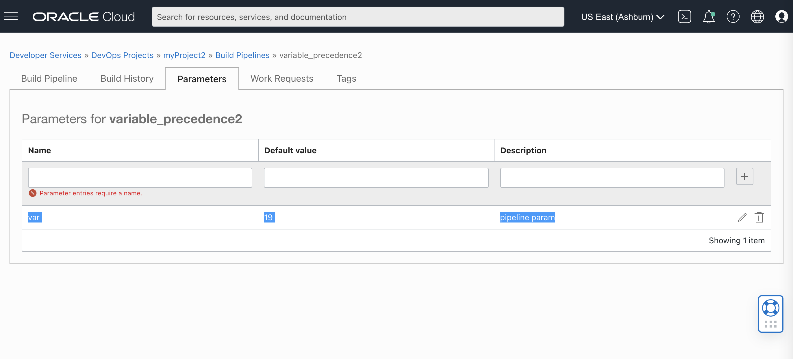
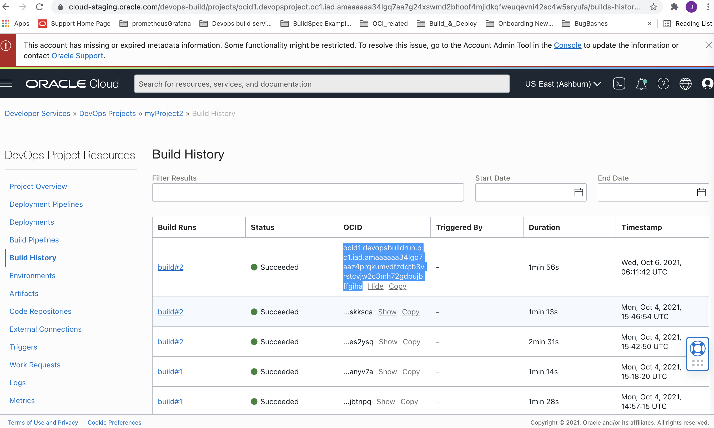
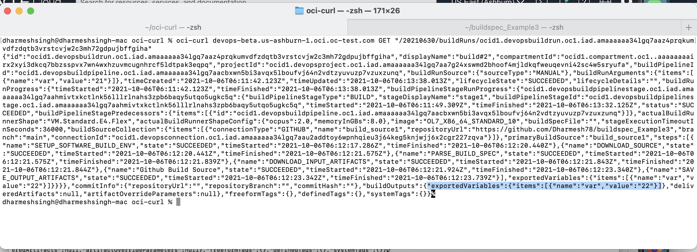

# buildspec_Example3

This is an example Hello World project using Java to demonstrate the precedence of exported variables over pipeline parameters and build run arguments, with the [OCI DevOps service](https://www.oracle.com/devops/devops-service/)


### Create External Connection to your Git repository 

1. Create a [DevOps Project](https://docs.oracle.com/en-us/iaas/Content/devops/using/devops_projects.htm) or use and an existing project. 
2. In your DevOps project, create an External Connection to your GitHub repository which holds your application.
   - Create a Personal Access Token (PAT): https://docs.github.com/en/github/authenticating-to-github/keeping-your-account-and-data-secure/creating-a-personal-access-token
   - In the OCI Console, Go to Identity & Security -> Vault and create a [Vault]( https://docs.oracle.com/en-us/iaas/Content/KeyManagement/Concepts/keyoverview.htm) in compartment of your own choice.
   - Create a Master Key that will be used to encrypt the PATs. 
   - Select Secrets from under Resources and create a secret using PAT obtained from GitHub account.
   - Make a note of the OCID of the secret.
   - Now, go to the desired project and select External Connection from the resources.
   - Select type as GitHub and provide OCID of the secret under Personal Access Token.
   - Finally, allow Build Service (dynamic group with DevOps Resources) to use a PAT secret by writing a policy in the root compartment as: ``` Allow dynamic-group dg-with-devops-resources to manage secret-family in tenancy```

### Setup your Build Pipeline
Create a new Build Pipeline to build, test and deliver artifacts from your GitHub Repository.

### Managed Build stage
In your Build Pipeline, first add a Managed Build stage
1. The Build Spec File Path is the relative location in your repo of the build_spec.yaml . Leave the default, for this example.
2. For the Primary Code Repository follow the below steps
    - Select connection type as GitHub
    - Select the external connection you created above
    - Give the URL to the repo which contains your application.
    - Select main branch.
    
### Specify Pipeline parameter
In your Build Pipeline , click on Parameters tab, and provide pipeline parameter as below:
Name: var       Value: 19       Description: pipeline parameter
Click on + tab to add this parameter



### Specify Exported variable
In your build_spec.yaml, specify "var" under exportedVariables section and in commands set the value of this variable to 22.

### Run your Build with Build run parameter using oci-curl


#### Setup oci-curl on localhosr
To configure access for oci-curl for the first time, follow this link https://confluence.oci.oraclecorp.com/display/DLCBLD/HOWTO%3A+Setup+oci-curl+on+localhost.


#### make a createBuildRun.json file and paste the followinf contents in it (BuildRun argument as var:22)
```
    {
    "displayName": "build#1",
    "buildPipelineId": <PIPELINE_ID>,
    "commitInfo": {
    "repositoryUrl": "string",
    "repositoryBranch": "string",
    "commitHash": "string"
    },
    "buildRunArguments": {
        "items": [
        {
            "name": "var",
            "value": "22"
        }
        ]
    },
    "freeformTags": {},
    "definedTags": {}
    }
```

#### Run your pipeline using oci-curl
```oci-curl devops-beta.us-ashburn-1.oci.oc-test.com POST createBuildRun.json "/20210630/buildRuns"```


### Check the build context after build run execution gets completed
1. Go to build history

2. Copy your Build Run OCID from current Build run
3. At the end of build run execution run the following command in your terminal
   oci-curl devops-beta.us-ashburn-1.oci.oc-test.com GET "/20210630/buildRuns/<BUILD_RUN_ID>"

  , you will find that the value of var changed to 22, which means the exportedVariable overrides both pipeline and build run parameter.

