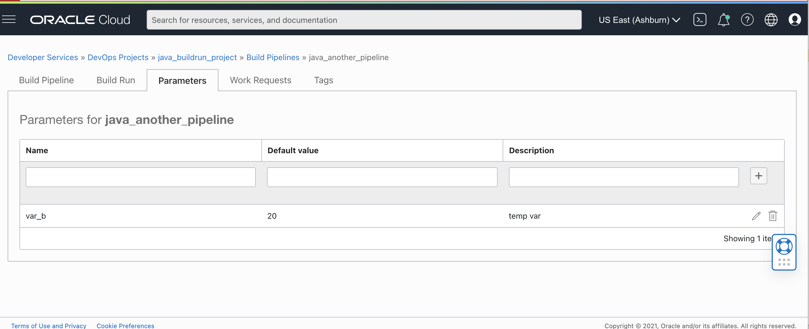
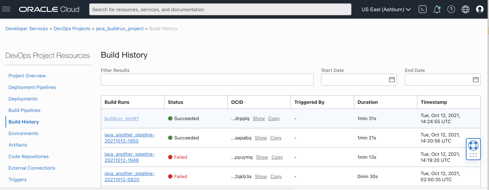
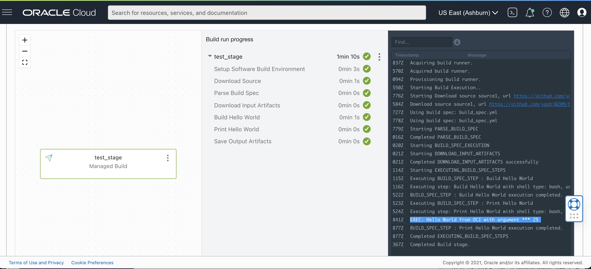

# Getting Started with OCI DevOps
This is a sample Hello World project in Java which demonstrates the precedence of build run arguments over pipeline parameters, with [OCI DevOps Service](https://www.oracle.com/devops/devops-service/).

### Create External Connection to your Git repository 

1. Create a [DevOps Project](https://docs.oracle.com/en-us/iaas/Content/devops/using/devops_projects.htm) or use and an existing project. 
2. Create an External Connection to your Github repository in your DevOps project.
   - Create a Personal Access Token (PAT): https://docs.github.com/en/github/authenticating-to-github/keeping-your-account-and-data-secure/creating-a-personal-access-token
   - In the OCI Console, Go to Identity & Security -> Vault and create a [Vault]( https://docs.oracle.com/en-us/iaas/Content/KeyManagement/Concepts/keyoverview.htm) in compartment of your own choice.
   - Create a Master Key that will be used to encrypt the PATs. 
   - Select Secrets from under Resources and create a secret using PAT obtained from Github account.
   - Make a note of the OCID of the secret.
   - Now, go to the desired project and select External Connection from the resources.
   - Select type as Github and provide OCID of the secret under Personal Access Token.
   - Finally, allow Build Pipeline (dynamic group with DevOps Resources) to use PAT secret by writing a policy in the root compartment as: ``` Allow dynamic-group dg-with-devops-resources to manage secret-family in tenancy```
  

### Enable logs for the Project 
Under the Project Overview, select ```Enable Log``` option. Select appropriate log group (create one if not created already. Reference: https://docs.oracle.com/en-us/iaas/Content/Logging/Task/managinglogs.htm), log name and enable service logs.

### Setup your Build Pipeline

Create a new Build Pipeline to build, test and deliver artifacts. 

#### Managed Build stage

In your Build Pipeline,add a Managed Build stage. 

1. The Build Spec File Path is the relative location in your repo of the build_spec.yml . Leave the default, for this example. 
2. For the Primary Code Repository 
   - Select connection type as Github
   - Select external connection you created above
   - Give the repo URL to the repo which contains build_spec.yml file.
   - Select main branch.
 
### Specify Pipeline parameters

In your Build Pipeline , click on Parameters tab, and provide pipeline parameter as shown below:
1. Name : var_b
2. Value : 20
3. Description : Pipeline Parameter
Click on '+' tab to add this parameter. 


 
### Running Build with Build Run Arguments using OCI-Curl 

To specify build run arguments, we make use of oci-curl commands.

#### Setup oci-curl on localhost

To setup oci-curl on localhost for the first time, follow the steps in this link :
https://confluence.oci.oraclecorp.com/display/DLCBLD/HOWTO%3A+Setup+oci-curl+on+localhost

#### Create a createBuildRun.json File

Create a json file which would be used to start a build run, with the following contents in it. Note that the BuildRun Argument specified here is 25.

```
    {
    "displayName": "build#1",
    "buildPipelineId": <PIPELINE_ID>,
    "commitInfo": {
    "repositoryUrl": "string",
    "repositoryBranch": "string",
    "commitHash": "string"
    },
    "buildRunArguments": {
        "items": [
        {
            "name": "var_b",
            "value": "25"
        }
        ]
    },
    "freeformTags": {},
    "definedTags": {}
    }
```

#### Start Build Run Using following oci-curl command 

On the terminal, enter this command from the directory where ```createBuildRun.json``` file is present.

``` oci-curl devops-beta.us-ashburn-1.oci.oc-test.com POST createBuildRun.json "/20210630/buildRuns" ```


### Check the Output Logs of the Build Run 

1. Go to Build History
2. Click on the latest Build Run, named ```build#1```

3. In the output logs on the right hand side of the screen, under "BUILD_SPEC_STEP : Print Hello World", observe the output. 

4. The ouput shown as below is : "Hello World from OCI with argument *** 25"


Since our pipeline parameter was assigned a value of 20 and Build Run parameter a value of 25, this demonstrates that Build Run arguments take precedence over the Build Pipeline Parameters. 


