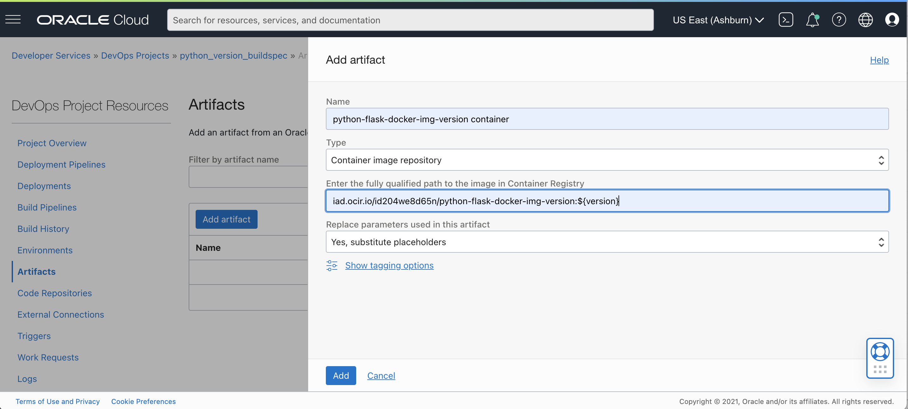
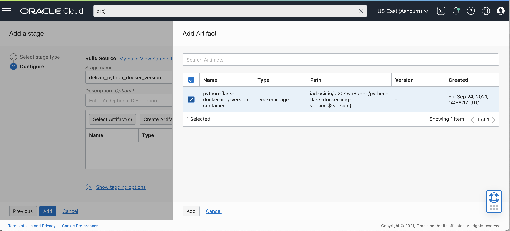
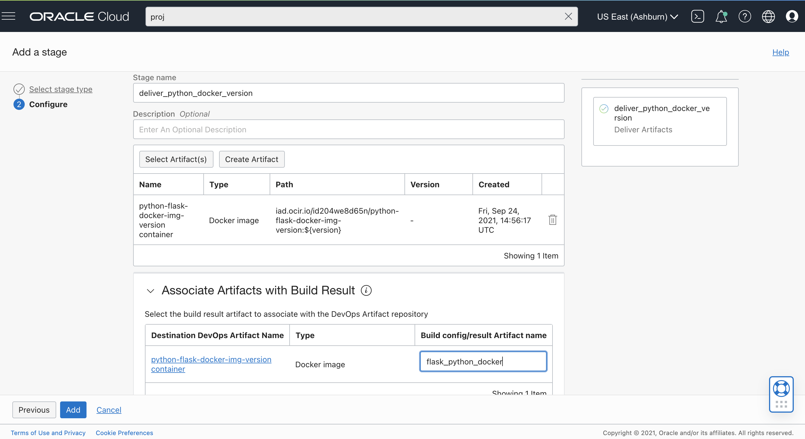

# Getting Started with OCI DevOps
This is a sample project, using Python with Flask framework to create a simple weight convertor web application. With [OCI DevOps Service](https://www.oracle.com/devops/devops-service/) and this project, you'll be able to build this application, configure the docker image version and store it in [Oracle Container Registry](https://docs.oracle.com/en-us/iaas/Content/Registry/Concepts/registryoverview.htm) (OCIR).

In this example, you'll build a container image of the Python Flask app, configure docker image version, test it locally and push your built container to the OCI Container Registry (OCIR) using the OCI DevOps service.

## Running the example locally 

### Clone the Repository 
The first step is to download the repository to your local workspace.

```
git clone git@github.com:dlcbld/BuildSpecSampleFiles.git
cd examples/buildspec_python_docker_img_version
```

### Install the Requirements and Run the App
Open a terminal and test out the python Flask web app example which acts as a simple weight metric convertor.

1. Downlaod and install python(3.x or higher): https://www.python.org/downloads/
2. Setup python3 virtual environment : ``` python3 -m venv venv ```
3. Activate the virtual environment : ```source venv/bin/activate ``` 
4. Install requirements (Flask) : ``` python3 -m pip install -r requirements.txt ```
5. Start the flask app : ``` python3 app.py ```
6. Verify the app locally : open your browser to http://127.0.0.1:8080/ or whatever port you set, if you've changed the local port.

### Build a container image for the App
You can locally build a container image using docker,providing docker image version, to verify that you can run the app within a container.

```
docker build -t python-flask-example:<docker-image-version> .
```

Verify the image was was built, by listing the images using ``` docker image ls```

Now, run your local container and confirm you can access the web app running in the container
```
docker run -d -p 5000:5000 python-flask-example:<docker-image-version>
```

And open your browser to http://127.0.0.1:5000/ 


## Build and test the app in OCI DevOps

Now that you've seen how you can locally build and test this app, let's build our CI/CD pipeline in OCI DevOps Service.

### Create External Connection to your Git repository 

1. Create a [DevOps Project](https://docs.oracle.com/en-us/iaas/Content/devops/using/devops_projects.htm) or use and an existing project. 
2. Create an External Connection to your Github repository in your DevOps project.
   - Create a Personal Access Token (PAT): https://docs.github.com/en/github/authenticating-to-github/keeping-your-account-and-data-secure/creating-a-personal-access-token
   - In the OCI Console, Go to Identity & Security -> Vault and create a [Vault]( https://docs.oracle.com/en-us/iaas/Content/KeyManagement/Concepts/keyoverview.htm) in compartment of your own choice.
   - Create a Master Key that will be used to encrypt the PATs. 
   - Select Secrets from under Resources and create a secret using PAT obtained from Github account.
   - Make a note of the OCID of the secret.
   - Now, go to the desired project and select External Connection from the resources.
   - Select type as Github and provide OCID of the secret under Personal Access Token.
   - Finally, allow Build Pipeline (dynamic group with DevOps Resources) to use PAT secret by writing a policy in the root compartment as: ``` Allow dynamic-group dg-with-devops-resources to manage secret-family in tenancy```

### Setup your Build Pipeline

Create a new Build Pipeline to build, test and deliver artifacts. 

#### Managed Build stage

In your Build Pipeline, first add a Managed Build stage. 

1. The Build Spec File Path is the relative location in your repo of the build_spec.yml . Leave the default, for this example. 
2. For the Primary Code Repository 
   - Select connection type as Github
   - Select external connection you created above
   - Give the repo URL to the repo which contains build_spec.yml file.
   - Select main branch.

#### Create a Container Registry repository

Create a [Container Registry repository](https://docs.oracle.com/en-us/iaas/Content/Registry/Tasks/registrycreatingarepository.htm) for the python-flask-example container image built in the Managed Build stage.
1. You can name the repo: ```python-flask-docker-img-version```. The path to the repo will be REGION/TENANCY-NAMESPACE/python-flask-docker-img-version
2. By default, the repository access is set to private. Policies can be added to manage access to the repository.

#### Create a DevOps Artifact for your container image repository

Reference :  https://docs.oracle.com/en-us/iaas/Content/devops/using/containerimage_repository_artifact.htm

The version of the container image that will be delivered to the OCI repository is defined by a parameter in the Artifact URI that matches a Build Spec File exported variable (the variable ```version``` in this example) or Build Pipeline parameter name.

In the project, under Artifacts, create a DevOps Artifact to point to the Container Registry repository location you just created above. Enter the information for the Artifact location:

1. Name: python-flask-docker-img-version container
2. Type: Container image repository
3. Path: REGION/TENANCY-NAMESPACE/python-flask-docker-img-version:${version} (Here, ${version} will pick up the exported variable version from ```build_spec.yml```)
4. Replace parameters: Yes, substitute placeholders



Required policies must be added in the root compartment for the Container Registry repository and DevOps Artifact resource.
1. Provide access to OCIR to deliver artifacts : ```Allow dynamic-group dg-with-devops-resources to manage repos in tenancy```
2. Provide access to read deploy artifacts in deliver artifact stage : ```Allow dynamic-group dg-with-devops-resources to manage devops-family in tenancy```

#### Add a Deliver Artifacts stage

Let's add a Deliver Artifacts stage to your Build Pipeline to deliver the ```python-flask-docker-img-version``` container to an OCI repository.

The Deliver Artifacts stage maps the output Artifacts from the Managed Build stage with the version to deliver to OCI Repository (OCIR) through the DevOps Artifact resource.

Add a Deliver Artifacts stage to your Build Pipeline after the Managed Build stage. To configure this stage:

1. In your Deliver Artifacts stage, choose ```Select Artifact```
2. From the list of artifacts select the ```python-flask-docker-img-version container``` artifact that you created above


3. Assign the container image outputArtifact from the ```build_spec.yml``` to the DevOps project artifact. For the "Build config/result Artifact name" enter: ```flask_python_docker`` (This name should be the same as the one mentioned in the outputArtifact section of the build_spec.yml file.


### Run your Build in OCI DevOps

#### From your Build Pipeline, choose Manual Run

Use the Manual Run button to start a Build Run

Manual Run will use the Primary Code Repository, will start the Build Pipeline, first running the Managed Build stage, followed by the Deliver Artifacts stage.

After the Build Pipeline execution is complete, we can view the container image stored in the OCI Container Registry.
