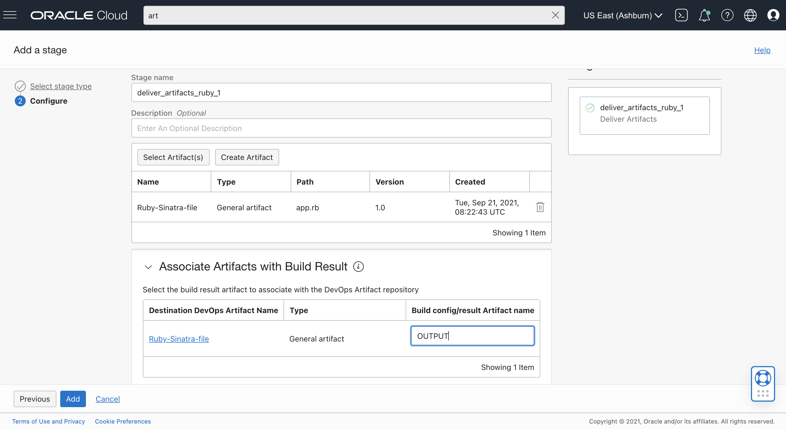

# Getting Started with OCI DevOps
This is a sample project, using Ruby with Sinatra framework to create a simple Hello World web application. With [OCI DevOps Service](https://www.oracle.com/devops/devops-service/) and this project, you'll be able to build this application and store the executable in [Oracle Artifact Registry](https://docs.oracle.com/en-us/iaas/artifacts/using/overview.htm).

In this example, you'll build a simple Ruby web application, test it locally and push your built artifact to the OCI Artifact Registry using the OCI DevOps service.

## Running the example locally 

### Clone the Repository 
The first step is to download the repository to your local workspace.

```
git clone git@github.com:yashj0209/buildspec_ruby_example.git
```

### Install the Requirements and Run the App
Open a terminal and test out the Ruby Hello World web app example.

1. Download and install Ruby : https://www.ruby-lang.org/en/downloads/
2. Verify Ruby is installed by : ```ruby -v```
3. Navigate to project's root directory : ```cd buildspec_ruby_example ```
4. Install bundler : ``` gem install bundler ```
5. Install other dependencies (listed in Gemfile): ``` bundle install``` . This will generate Gemfile.lock
6. Run the application : ``` ruby app.rb ```

Now, confirm you can access the web app running in the browser by open your browser to http://0.0.0.0:9000/ or according to any other port specified in ```app.rb``` 


## Build and test the app in OCI DevOps

Now that you've seen how you can locally test this app, let's build our CI/CD pipeline in OCI DevOps Service.

### Create External Connection to your Git repository 

1. Create a [DevOps Project](https://docs.oracle.com/en-us/iaas/Content/devops/using/devops_projects.htm) or use and an existing project. 
2. Create an External Connection to your Github repository in your DevOps project.
   - Create a Personal Access Token (PAT): https://docs.github.com/en/github/authenticating-to-github/keeping-your-account-and-data-secure/creating-a-personal-access-token
   - In the OCI Console, Go to Identity & Security -> Vault and create a [Vault]( https://docs.oracle.com/en-us/iaas/Content/KeyManagement/Concepts/keyoverview.htm) in compartment of your own choice.
   - Create a Master Key that will be used to encrypt the PATs. 
   - Select Secrets from under Resources and create a secret using PAT obtained from Github account.
   - Make a note of the OCID of the secret.
   - Now, go to the desired project and select External Connection from the resources.
   - Select type as Github and provide OCID of the secret under Personal Access Token.
   - Finally, allow Build Pipeline (dynamic group with DevOps Resources) to use PAT secret by writing a policy in the root compartment as: ``` Allow dynamic-group dg-with-devops-resources to manage secret-family in tenancy```

### Setup your Build Pipeline

Create a new Build Pipeline to build, test and deliver artifacts. 

#### Managed Build stage

In your Build Pipeline, first add a Managed Build stage. 

1. The Build Spec File Path is the relative location in your repo of the build_spec.yml . Leave the default, for this example. 
2. For the Primary Code Repository 
   - Select connection type as Github
   - Select external connection you created above
   - Give the repo URL to the repo which contains build_spec.yml file.
   - Select main branch.

#### Create an Artifact Registry

Create an [Artifact Registry](https://docs.oracle.com/en-us/iaas/artifacts/using/manage-repos.htm) to store executable ruby file from Managed Build stage.
1. Go to Artifact Registry in OCI Console and click on Create Repository
2. You can name the artifact repo: ```ruby-sinatra-example-repo```


#### Create a DevOps Artifact for your Artifact Registry

In the project, under Artifacts, create a DevOps Artifact to point to the Artifact repository location you just created above. Enter the information for the Artifact location:

1. Name: Ruby-Sinatra-File
2. Type: General Artifact 
3. Artifact Source : Artifact Registry repository 
4. Select Artifact registry repository as the one created in previous steps
5. Artifact location: Choose set Custom location and provide path and version
6. Replace parameters: Yes, substitute placeholders


#### Add a Deliver Artifacts stage

Let's add a Deliver Artifacts stage to your Build Pipeline to deliver the ```Ruby-Sinatra-File``` artifact to the Artifact Registry.

The Deliver Artifacts stage maps the output Artifacts from the Managed Build stage to deliver to the Artifact Registry through a DevOps Artifact resource.

Add a Deliver Artifacts stage to your Build Pipeline after the Managed Build stage. To configure this stage:

1. In your Deliver Artifacts stage, choose ```Select Artifact```
2. From the list of artifacts select the ```Ruby-Sinatra-File``` artifact that you created above


3. Assign the outputArtifact from the ```build_spec.yml``` to the DevOps project artifact. For the "Build config/result Artifact name" enter: ```OUTPUT``` (This name should be the same as the one mentioned in the outputArtifact section of the build_spec.yml file).


### Run your Build in OCI DevOps

#### From your Build Pipeline, choose Manual Run

Use the Manual Run button to start a Build Run

Manual Run will use the Primary Code Repository, will start the Build Pipeline, first running the Managed Build stage, followed by the Deliver Artifacts stage.

After the Build Pipeline execution is complete, we can view the file stored in the OCI Artifact Registry, which can then be downloaded to local workspace (Under Ellipses , choose ``` Download```).
