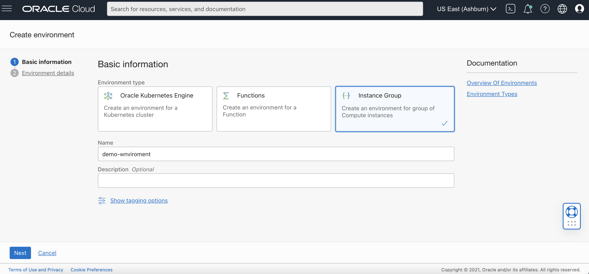
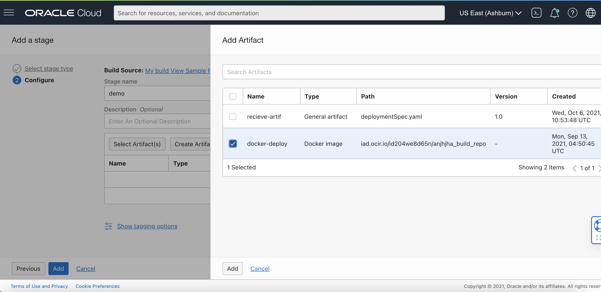
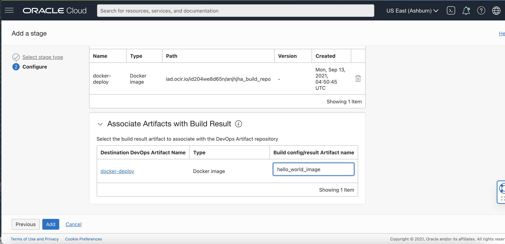

# Build Spec File Example using Java and Docker to deploy to a Instance

This is an example Hello World project using Java SE JDK 11 and Docker. With the [OCI DevOps service](https://www.oracle.com/devops/devops-service/)
and this project, you'll be able to build this application, build a Docker image and store it in
[OCI Container Registry.](https://docs.oracle.com/en-us/iaas/Content/Registry/Concepts/registryoverview.htm) We will then trigger a deployment pipeline
which deploys this image to a Instance.

In this example, you'll build a container image of this Java Hello World app, store your built container in the OCI Container Registry, and trigger a
Instance deployment all using the OCI DevOps service!

Let's go!

## Building the application locally

### Download the repo
The first step to get started is to download the repository to your local workspace

```shell
git clone git@github.com:dlcbld/BuildSpecSampleFiles.git
cd examples/java-docker-buildspec-sample
```

### Install and run the application

1. Install Java SE SDK 11 on your system: https://java.com/en/download/help/download_options.html
2. Compile the app:

   ```javac src/com/sample/Main.java```
3. Run the app:
   ```java src/com/sample/Main```
4. To verify, make sure the string "Hello World" is printed in the shell.
### Build a container image for the app
You can locally build a container image using docker (or your favorite container image builder), to verify that you can run the app within a container.
```
docker build -t hello-world:1.0 .
```
Verify that your image was built, with `docker images`
Next run your local container and confirm you can access the app running in the container
```
docker run --rm -d --name hello-world:latest
```
The string "Hello World" must be printed in the shell if your container has been built successfully.
## Building the application in OCI DevOps
Now that you've seen you can locally build this app, let's try this out through OCI DevOps Build service.
### Setting up your Instance
Create a [Instance](https://docs.oracle.com/en-us/iaas/Content/Compute/Tasks/launchinginstance.htm) for deploying OCIR image by deployment stage.
1. Make sure it has [Administrator Privileges](https://docs.oracle.com/en-us/iaas/Content/Compute/Tasks/runningcommands.htm#administrator-privileges)
2. Add [IAM policy](https://docs.oracle.com/en-us/iaas/Content/Compute/Tasks/runningcommands.htm#permissions)
3. Install [docker](https://docs.oracle.com/en/operating-systems/oracle-linux/docker/docker-install.html#docker-install-docker) in Instance to deploy OCIR image
### Create a Container Registry repository
Create a [Container Registry repository](https://docs.oracle.com/en-us/iaas/Content/Registry/Tasks/registrycreatingarepository.htm) for the `hello-world` container image built in the Managed Build stage.
1. You can name the repo: `java-docker-buildspec-sample-image`. So if you create the repository in the Ashburn region, the path is iad.ocir.io/TENANCY-NAMESPACE/java-docker-buildspec-sample-image
2. Set the repository access to private for security reasons. You can add policies to manage access for the same.

### Setting up an Environment
1. Create a [DevOps Project](https://docs.oracle.com/en-us/iaas/Content/devops/using/devops_projects.htm) or use and an existing project.
2. In your DevOps project, go to the Environments section and select Create Environment.
3. Fill in the necessary details and select ```Create Environment for a Instance```.
4. In the next step, choose your Application and the Instance created in the previous steps.
   
### Create External Connection to your Git repository
1. In your DevOps project, create an External Connection to your GitHub repository which holds your application.
   - Create a Personal Access Token (PAT): https://docs.github.com/en/github/authenticating-to-github/keeping-your-account-and-data-secure/creating-a-personal-access-token
   - In the OCI Console, Go to Identity & Security -> Vault and create a [Vault]( https://docs.oracle.com/en-us/iaas/Content/KeyManagement/Concepts/keyoverview.htm) in compartment of your own choice.
   - Create a Master Key that will be used to encrypt the PATs.
   - Select Secrets from under Resources and create a secret using PAT obtained from GitHub account.
   - Make a note of the OCID of the secret.
   - Now, go to the desired project and select External Connection from the resources.
   - Select type as GitHub and provide OCID of the secret under Personal Access Token.
   - Finally, allow BuildPipeline (dynamic group with DevOps Resources) to use a PAT secret by writing a policy in the root compartment as: ``` Allow dynamic-group dg-with-devops-resources to manage secret-family in tenancy```

### Create a DevOps Artifact for your container image repository
Reference :  https://docs.oracle.com/en-us/iaas/Content/devops/using/containerimage_repository_artifact.htm
The version of the container image that will be delivered to the OCI repository is defined by a [parameter](https://docs.oracle.com/en-us/iaas/Content/devops/using/configuring_parameters.htm) in the Artifact URI that matches a Build Spec exported variable or Build Pipeline parameter name.
Create a DevOps Artifact to point to the Container Registry repository location you just created above. Enter the information for the Artifact location:
1. Name: `java-docker-buildspec-sample-artifact`
1. Type: Container image repository
1. Path: `REGION/TENANCY-OBJECT-STORAGE-NAMESPACE/java-docker-buildspec-sample-image`
### Create a Artifact Registry repository
Create a [Artifact Registry repository](https://docs.oracle.com/en-us/iaas/artifacts/using/manage-repos.htm#create-repo) for the `deploymentspec.yaml` file to store by Build stage.

### A.  Create a DevOps Artifact for your Artifact repository(Store in Artifact repository)
The version of the jar file that will be delivered to the OCI repository is defined by a [parameter](https://docs.oracle.com/en-us/iaas/Content/devops/using/configuring_parameters.htm) in the Artifact URI that matches a Build Spec exported variable or Build Pipeline parameter name.

Create a DevOps Artifact to point to the Artifact Registry repository location you just created above. Enter the information for the Artifact location:
1. Name: `deploymentspec_deliver`
2. Type: General Artifact
3. Artifact source: Artifact Registry repository
4. Version: ${version} (assign some parameter eg:- 1.0, 2.0)

### B.  Create a DevOps Artifact for your Artifact repository(Receive from Artifact repository)
The version of the jar file that will be delivered to the OCI repository is defined by a [parameter](https://docs.oracle.com/en-us/iaas/Content/devops/using/configuring_parameters.htm) in the Artifact URI that matches a Build Spec exported variable or Build Pipeline parameter name.

Create a DevOps Artifact to point to the Artifact Registry repository location you just created above. Enter the information for the Artifact location:
1. Name: `deploymentspec_recieve` 
2. Type: Instance group deployment configuration 
3. Artifact source: Artifact Registry repository
4. Version: ${version} (assign some parameter eg:- 1.0, 2.0)
Note :- The path here should be same as step A.

### Setting up your Build Pipeline
Create a new Build Pipeline to build, test and deliver artifacts from your GitHub Repository.
### Managed Build stage
In your Build Pipeline, first add a Managed Build stage
1. The Build Spec File Path is the relative location in your repo of the build_spec.yaml . Leave the default, for this example.
2. For the Primary Code Repository follow the below steps
   - Select connection type as GitHub
   - Select the external connection you created above
   - Give the HTTPS URL to the repo which contains your application.
   - Select main branch.
### Add a Deliver Artifacts stage
Let's add a **Deliver Image Artifacts** stage to your Build Pipeline to deliver the `java-docker-buildspec-sample` container image to an OCI repository.
The Deliver Artifacts stage **maps** the ouput Artifacts from the Managed Build stage with the version to deliver to OCI Container Registry, through the DevOps Artifact Resource.
Add a **Deliver Artifacts** stage to your Build Pipeline after the **Managed Build** stage. To configure this stage:
1. In your Deliver Image Artifacts stage, choose `Select Artifact`
2. From the list of artifacts select the `java-docker-buildspec-sample-artifact` artifact that you created above
   
3. In the next section, you'll assign the  container image outputArtifact from the `build_spec.yaml` to the DevOps project artifact. For the "Build config/result Artifact name" enter: `hello_world_image`
   

### Add another Deliver Artifacts stage
Let's add a **Deliver deploymentspec Artifacts ** stage to your Build Pipeline to deliver the `deploymentspec.yaml` file to an OCI Artifact repository.
The Deliver Artifacts stage **maps** the ouput Artifacts from the Managed Build stage with the version to deliver to OCI Artifact Registry, through the DevOps Artifact Resource.
Add a **Deliver deploymentspec Artifacts** stage to your Build Pipeline after the **Deliver Image Artifact** stage. To configure this stage:
1. In your Deliver deployment Artifacts stage, choose `Select Artifact`
   
2. From the list of artifacts select the `deploymentspec_deliver` artifact that you created above
   
3. In the next section, you'll assign the Generic outputArtifact from the `build_spec.yaml` to the DevOps project artifact. For the "Build config/result Artifact name" enter: `deploymentSpec`
   
### Setting up your Deployment Pipeline
Create a new Deployment Pipeline to deploy the Instance that we just created.
### Instance Deployment Stage
1. In your Deployment Pipeline, select the default Instance stage under Deploy.
2. Enter the necessary details and select the Environment, artifact created as well.
3. The Artifact we choose here will be `deploymentspec_recieve`

### Trigger Deployment Stage
1. In your BuildPipeline, again go to add stage and select Trigger Deployment Stage.
2. Enter the necessary details and select the Deployment Pipeline that we just created which maps to our target Instance.
### Putting it all together
From your Build Pipeline, choose `Manual Run`.
Manual Run will use the Primary Code Repository, will start the Build Pipeline, first running the Managed Build stage, followed by the Deliver Artifacts stage.At the
end of this stage, the image is newly built and is updated in the container repository we created. Then it triggers a deployment pipeline which then deploys/updates
the Instance with the new image from our container repository.