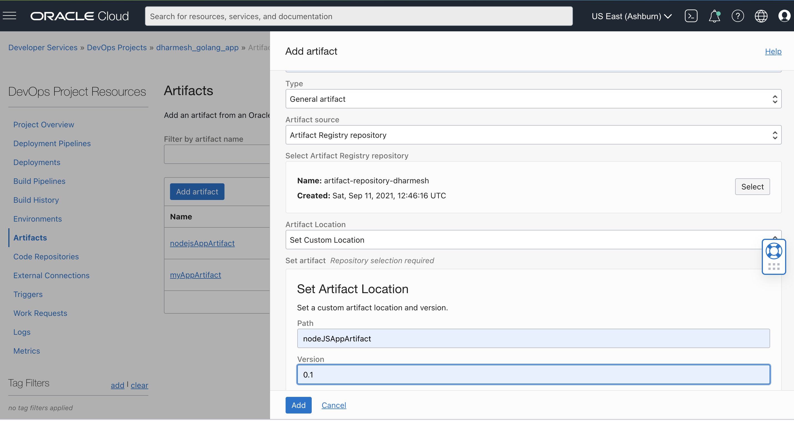
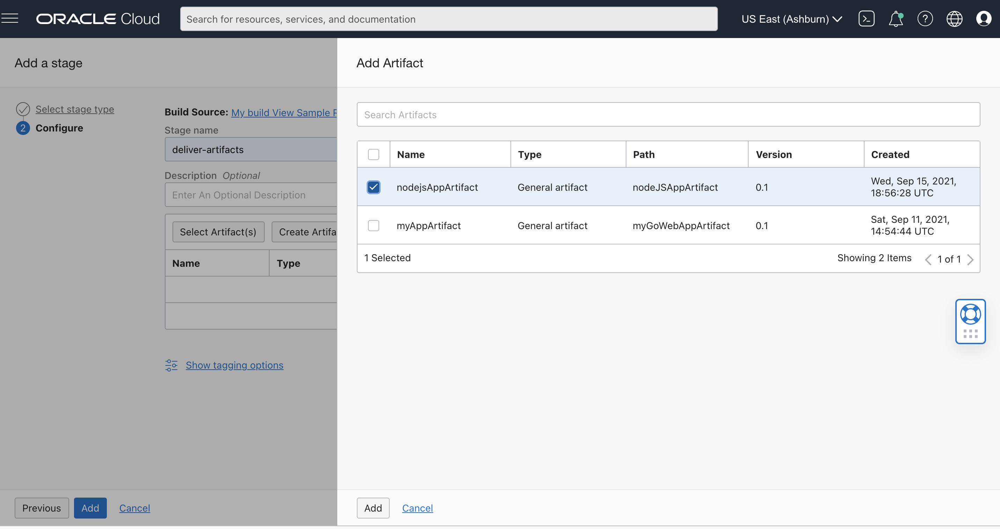
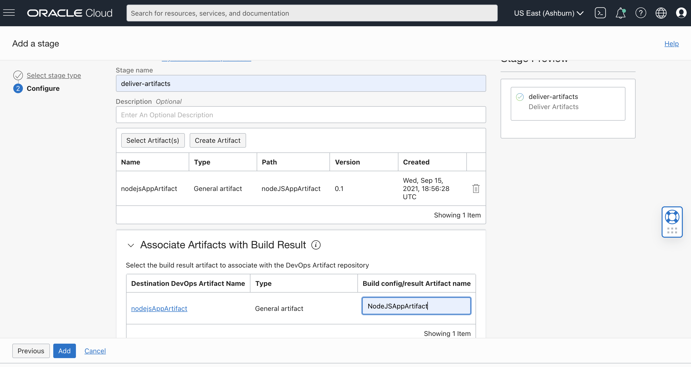

# Build Spec File Example using nodeJS web application and Creating an executable file

This is an example of a nodejs web application and creating an executable file. With the [OCI DevOps service](https://www.oracle.com/devops/devops-service/) and this project, you'll be able to build this application,store the executable file in [OCI Artifact Registry.](https://docs.oracle.com/en-us/iaas/artifacts/using/overview.htm)


## Building the application locally

### Download the repo
The first step to get started is to download the repository to your local workspace

```shell
git clone git@github.com:dlcbld/BuildSpecSampleFiles.git
cd examples/nodejs_example
```

### Install and run the application

1. Install nodejs on your system: 
    ```yum install -y oracle-nodejs-release-el7 oracle-release-el7```
2. Check that path is set properly by displaying version:
    ```npm -version```
3. Install the pkg library
    ```npm install --global pkg```
4. Package the nodejs web application file alongwith necessary modules using following command: 

   ```pkg app.js```
5. Run the app:
    ```./app-macos```

## Building the application in OCI DevOps
Now that you've seen you can locally build this app, let's try this out through OCI DevOps Build service.
### Create External Connection to your Git repository 
1. Create a [DevOps Project](https://docs.oracle.com/en-us/iaas/Content/devops/using/devops_projects.htm) or use and an existing project. 
2. In your DevOps project, create an External Connection to your GitHub repository which holds your application.
   - Create a Personal Access Token (PAT): https://docs.github.com/en/github/authenticating-to-github/keeping-your-account-and-data-secure/creating-a-personal-access-token
   - In the OCI Console, Go to Identity & Security -> Vault and create a [Vault]( https://docs.oracle.com/en-us/iaas/Content/KeyManagement/Concepts/keyoverview.htm) in compartment of your own choice.
   - Create a Master Key that will be used to encrypt the PATs. 
   - Select Secrets from under Resources and create a secret using PAT obtained from GitHub account.
   - Make a note of the OCID of the secret.
   - Now, go to the desired project and select External Connection from the resources.
   - Select type as GitHub and provide OCID of the secret under Personal Access Token.
   - Finally, allow Build Pipeline (dynamic group with DevOps Resources) to use a PAT secret by writing a policy in the root compartment as: ``` Allow dynamic-group dg-with-devops-resources to manage secret-family in tenancy```
### Setup your Build Pipeline
Create a new Build Pipeline to build, test and deliver artifacts from your GitHub Repository.
### Managed Build stage
In your Build Pipeline, first add a Managed Build stage
1. The Build Spec File Path is the relative location in your repo of the build_spec.yaml . Leave the default, for this example.
2. For the Primary Code Repository follow the below steps
    - Select connection type as GitHub
    - Select the external connection you created above
    - Give the URL to the repo which contains your application.
    - Select main branch.
    
### Create a Artifact Registry repository
Create a [Artifact Registry repository](https://docs.oracle.com/en-us/iaas/artifacts/using/manage-repos.htm#create-repo).

### Create a DevOps Artifact for your artifact repository
Create a DevOps Artifact to point to the Artifact Registry repository location you just created above. Enter the information for the Artifact location:
1. Name: `myNodeJSAppArtifact`
2. Type: General Artifact

3. Artifact source: Artifact registry Repository
    Select your Artifact Registry repository created in previous step.
4. Artifact Location: Set custom location
5. Path: `REGION/TENANCY-NAMESPACE/myNodeJSAppArtifact`
6. Replace parameters: Yes


Required policies must be added in the root compartment for the Artifact Registry repository and DevOps Artifact resource.

1. Provide access to General Artifactory to deliver artifacts : ```Allow dynamic-group dg-with-devops-resources to manage repos in tenancy```
2. Provide access to read deploy artifacts in deliver artifact stage : ```Allow dynamic-group dg-with-devops-resources to manage devops-family in tenancy```

### Add a Deliver Artifacts stage
Let's add a **Deliver Artifacts** stage to your Build Pipeline to deliver the `app-macos` executable file to an OCI repository.
The Deliver Artifacts stage **maps** the ouput Artifacts from the Managed Build stage with the version to deliver to a DevOps Artifact resource, and then to the OCI repository.
Add a **Deliver Artifacts** stage to your Build Pipeline after the **Managed Build** stage. To configure this stage:
1. In your Deliver Artifacts stage, choose `Select Artifact`

2. From the list of artifacts select the `myNodeJSAppArtifact` artifact that you created above
3. In the next section, you'll assign the image outputArtifact from the `build_spec.yaml` to the DevOps project artifact. For the "Build config/result Artifact name" enter: `NodeJSAppArtifact`



### Run your Build in OCI DevOps

#### From your Build Pipeline, choose `Manual Run`
Use the Manual Run button to start a Build Run

Manual Run will use the Primary Code Repository, will start the Build Pipeline, first running the Managed Build stage, followed by the Deliver Artifacts stage.

After the Build Pipeline execution is complete, we can view the executable file stored in the OCI Artifact Registry, which can then be downloaded to local workspace. 
