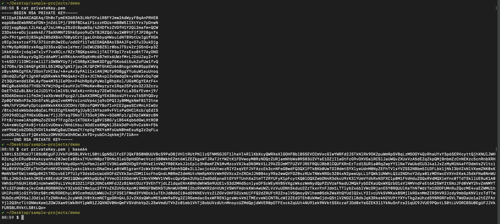
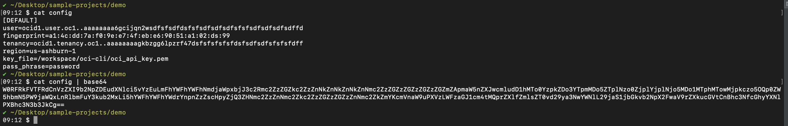

# Setup oci cli with api key in the build spec file

This example outlines manually setting up api key from the build spec file.

# Prerequisite

- OCI Tenancy
- Api key setup. [Reference Link.](https://docs.oracle.com/en-us/iaas/Content/API/SDKDocs/cliinstall.htm)

# Setup Vault

To setup oci cli with api key we need:
1. oci private api key
1. config file

We are storing both these details in vault service.

1. Copy the base64 encoded private key as shown below and create a secret in the vault as plain text.  

1. Copy the base64 encoded config file as shown below and create a secret in the vault as plain text. In the config file make sure you put correct tennacy id, user ocid. key_file need not be changed as we are downloading the key_file in the same path in the build spec file.  

After creating secrets make a note of the ocid of the secrets. 

# Build Spec file

- copy the build_spec.yml file to your project
- replace the secret ocids in the vaultVariables section.
- create build pipeline and configure this build spec file for testing.